```{r setup, include=FALSE}
options(tinytex.verbose = TRUE)
knitr::opts_chunk$set(echo = FALSE)
knitr::opts_chunk$set(fig.width=12, fig.height=8) 
require("knitr")
opts_knit$set(root.dir = "F:/0001/Teaching/R")
```
# Basic Concepts

## Population(总体) and Sample(样本)

### Definition

- A **population** is a collection of people, items, or events about which you want to make inferences.

  - Population always have a probability distribution.

-  A **sample** is a subset of population, which draw from population in a certain way.

  - The sample could also follow a probability distribution.

- To represent the population well,a sample should be **randomly** collected and adequately **large**.

## Random sample(随机样本) and i.i.d(独立同分布)

### Definition

- The r.v.s are called a **random sample** of size n from the population $f(x)$ if $X_1, ..., X_n$ are mutually independent and have the same p.d.f/p.m.f $f(x)$. 
- Alternatively, $X_1, ..., X_n$ are called independent,and identically distributed random variable with p.d.f/p.m.f ,commonly abbreviated to **i.i.d.** r.v.s.

  - e.g.Random sample of n respondents in a survey.

- And the joint p.d.f/p.m.f of $X_1,...,X_n$ is given by $f(x_1,...,x_n)=f(x_1)...f(x_n)=\prod^{n}_{i=1}f(x_i)$


## Statistic(统计量) and Sampling Distribution(抽样分布)

### Definition 

- $X_1,...,X_n$ is a random sample of size n from the population $f(x)$. 

- A **statistic**(T) is a real-valued or vector-valued function fully depended on $X_1, ..., X_n$, thus $T = T(X_1,...,X_n)$

  - The expectation of sample is a statistic. 
  - A statistic is only a function of the sample(统计量是样本的函数).
  - The probability distribution of a statistic $T$ is called the **sampling distribution(抽样分布)** of $T$.

## Sample Mean(样本均值) and Sample Variance(样本方差)

### Definition --Two common and important estimators

- The **sample average** or **sample mean**, $\bar{X}$ of the n observations $X_1, ..., X_n$ is $$\bar{X}=\frac{1}{n}(X_1+X_2+...+X_n)=\frac{1}{n} \sum_{i=1}^{n}X_i$$

- Accordingly, the **sample variance** is defined by
$$
S^2=\frac{1}{n-1}\sum_{i=1}^{n}(X_i-\bar{X})
$$

---

### Deduction

- As we know that if $X_i$ is a random variable(r.v.), then $f(X_i)$, which is a function of $X_i$, is also a r.v. (随机变量的函数还是随机变量)
- So if $X_i$ is a r.v., then $\sum_{}^{}X_i$ is also a r.v..

  - The sample mean and the sample variance are also functions of sums, **therefore they are r.v.s, too.**
  - Assume that there are some certain probability functions which can describe distributions of the sample mean and the sample variance.
  - Then, naturally, what is the expectation, variance or p.d.f./c.d.f of these distributions?

## A simple case of sample mean

- Let $X_n\in[1, 100]$, assume n = 2, thus only $X_1$ and $X_2$

```{r, echo=FALSE, fig.cap="", out.width = '85%'}
    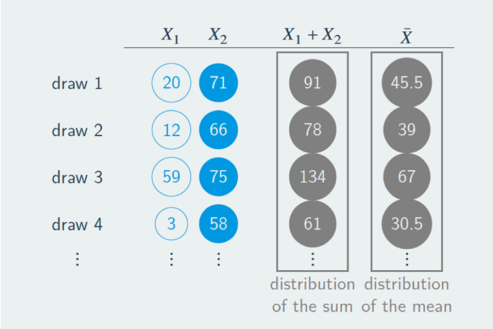
```

# Large-Sample Approximations to Sampling Distributions

## Sampling Distributions

1. There are two approaches to characterizing sampling distributions: 
- **exact/finite sample distribution**: The sampling distribution that exactly describes the distribution of X for any n is called the exact/finite sample distribution of X.
  
- **approximate/asymptotic distribution**: When the sample size n is large, the sample distribution approximates to a certain distribution function.

## Two Key Tools: L.L.N and C.L.T

2. Two key tools used to approximate sampling distributions when the sample size is large,assume that $n \rightarrow \infty$

- **The Law of Large Numbers(L.L.N.)**: when the sample size is large,$X$ will be close to $\mu_Y$ the population mean with very high probability.

- **The Central Limit Theorem(C.L.T.)**: when the sample size is large, the sampling distribution of the standardized sample  average,$$\frac{(\bar{Y}-\mu_Y)}{\sigma_Y}$$ is approximately normal. 

## Convergence in probability(依概率收敛)

### Definition

- Let $X_1,...,X_n$ be an random variables or sequence, is said to converge in probability to a value $b$ if for every $\varepsilon > 0$, $$P(\|X_n-b\|>\varepsilon)\rightarrow 0$$ as $n \rightarrow \infty$. We denote this as $X_n \stackrel{p}\longrightarrow b$ or $plim(X_n)=b$.

  - It is similar to the concept of a limitation in a probability way.

## The Law of Large Numbers(大数定律)

### Theorem

- Let $X_1,...,X_n$ be an **i.i.d** draws from a distribution with mean $\mu$ and finite variance $\sigma^2$(a population) and $\bar{X}=\frac{1}{n}\sum_{i=1}^{n}X_i$ is the **sample mean** then 
$$\bar{X}\rightarrow\mu$$

  - Intuition: the distribution of $\bar{X_n}$ "collapses" on $\mu$
  - 直观解释： 抽样的样本量越大，样本平均值越接近总体平均值，即抽样分布更紧凑。

## A simple case

### Example
- Suppose $X$ has a **Bernoulli** distribution if it have a binary values $X\in {0, 1}$ and its probability mass function is 
$$
P(X=x)=
\left \{\begin{array}{cc}
0.78,& if\;x=1 \cr
0.22,& if \;x=0
\end{array}\right.
$$

  - Then $E(X)=p=0.78$ and $Var(X)=p(1-p)=0.1716$

## A simple case

```{r, echo=FALSE, fig.cap="", out.width = '80%'}
    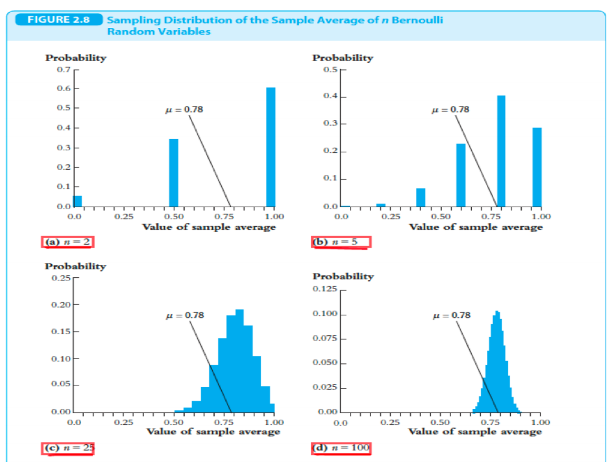
```

## Convergence in Distribution(分布收敛)

### Definition

Let $X_1,...,X_n$ be a sequence of r.v.s, and for n = 1,2,... let $F_n(x)$ be the c.d.f of $X_n$. Then it is said that $X_1,X_2,...$ **converges** in distribution to r.v. $W$ with c.d.f, $F_W$ if $$\mathop{lim}_{n\longrightarrow\infty}F_n(x)=F_W(x)$$
which we write as $$X_n \stackrel{p}\longrightarrow W$$

- Basically: when $n$ is big, the distribution of $X_n$ is **very similar** to the distribution of $W$.
- Standardize: by subtracting its expectation and dividing by its standard deviation
$$
Z=\frac{X-E[X]}{Var[X]}
$$

## The Central Limit Theorem(中心极限定理)

### Theorem

Let $X_1,...,Xn$ be an i.i.d draws from a distribution with sample size n with mean $\mu$ and $0 <\sigma^2<\infty$, then
$$
\frac{\bar{X_n}-\mu}{\frac{\sigma}{\sqrt{n}}}\stackrel{d}{\sim} N(0,1)
$$

- Because we don't have to make any specific assumption about the distribution of $X_i$, so whatever the distribution of $X_i$, when n is big, 
  - the standardized $$\bar{X_n}\sim N(\mu, \frac{\sigma^2}{n})$$
  - or $$\bar{X_n}\sim N(0,1)$$
- 直观理解：选取的样本量越大，样本均值的分布越趋于**正态分布**

## Example
```{r, echo=FALSE, fig.cap="", out.width = '85%'}
    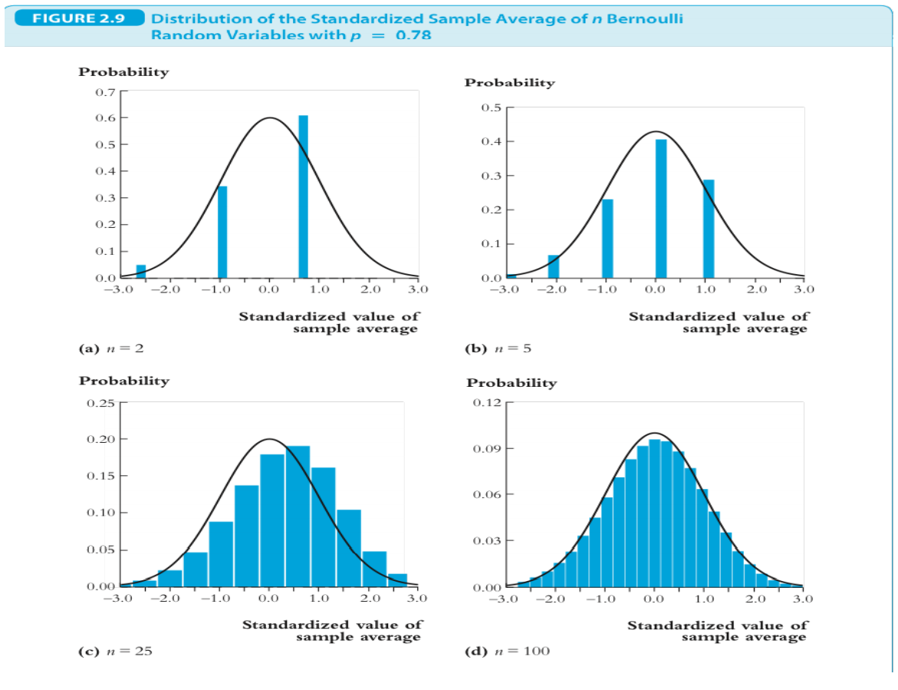
```
## Example
```{r, echo=FALSE, fig.cap="", out.width = '85%'}
    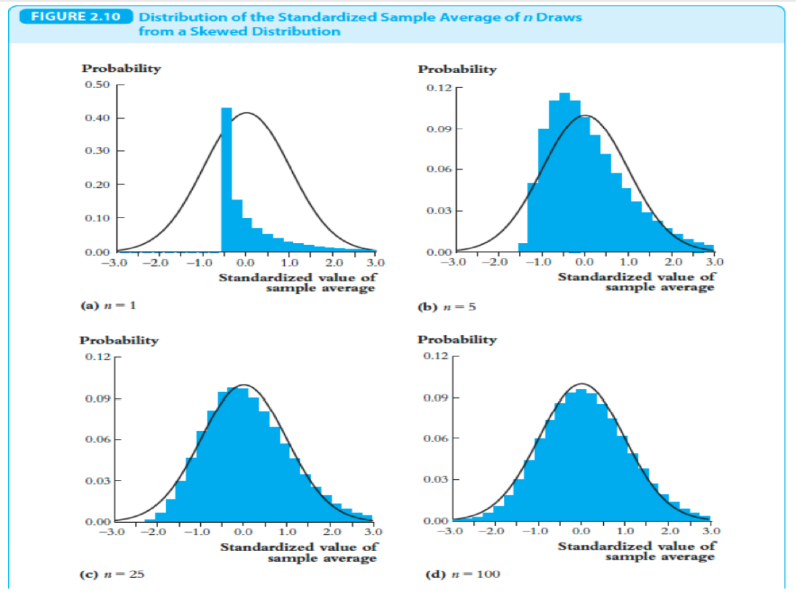
```


## How large is "large enough"?

- How large is **large enough**?
  - how large must $n$ be for the distribution of $\bar{Y}$ to be approximately normal?
- The answer: it depends.
  - if $Y_i$ are themselves normally distributed, then $\bar{Y}$ is exactly normally distributed for all n.
  - if $Y_i$ themselves have a distribution that is far from normal, then this approximation can require $n = 30$ or even more.

# Statistical Inference: Estimation, Confident Intervals and Testing

## Statistical Inference: From Samples to Population

### **Inference**

- What is our best guess about some quantity of interest?
- What are a set of plausible values of the quantity of interest?
- Our focus: $\{Y_1,Y_2,...,Y_n\}$ are **i.i.d.** draws from $f(y)$ or $F(Y)$, thus **population** distribution.
- **Statistical inference** or learning is using **samples** to infer $f(y)$.
  - Two ways: parametric and Non-parametric
  - Normally, we don't need to know everything of the population, just some measures (the moment) enough to describe the characteristics of the population.

## Statistical Inference: Point estimation

**Point estimation**: providing a single "best guess" as to the value of some fixed, unknown quantity of interest,$\theta$ which is a feature of the population distribution, $f(y)$.

**Example**

  1. $\mu=E[Y]$
  2. $\sigma^2=Var[Y]$
  3. $\mu_y-\mu_x=E[Y]-E[X]$

## Three Characteristics of an Estimator

Let $\hat\mu_Y$ denote some estimation value of the population moment, $\mu_Y$ and $E(\hat\mu_Y)$ is the mean of the sampling distribution of $\hat\mu_Y$

1. **Unbiasedness**: the estimator of $\mu_Y$ is unbiased if
$$
E(\hat\mu_Y)=\hat\mu_Y
$$
2. **Consistency**: the estimator of $\mu_Y$ is consistent if 
$$
E(\hat\mu_Y)\rightarrow\hat\mu_Y
$$


## Three Characteristics of an Estimator
3. **Efficiency**: Let $\widetilde\mu_Y$ be another estimator of $\mu_Y$ and suppose that both $\widetilde\mu_Y$ and $\hat\mu_Y$ are unbiaesd.Then $\hat\mu_Y$ is said to be more **efficient** than $\widetilde\mu_Y$
$$
var(\hat\mu_Y) < var(\widetilde\mu_Y)
$$
  - Comparing variances is difficult if we don't restrict our attention to unbiased estimators because we could always use a trivial estimator with variance zero that is biased.

## Unbiased
```{r, echo=FALSE, fig.cap="", out.width = '90%'}
    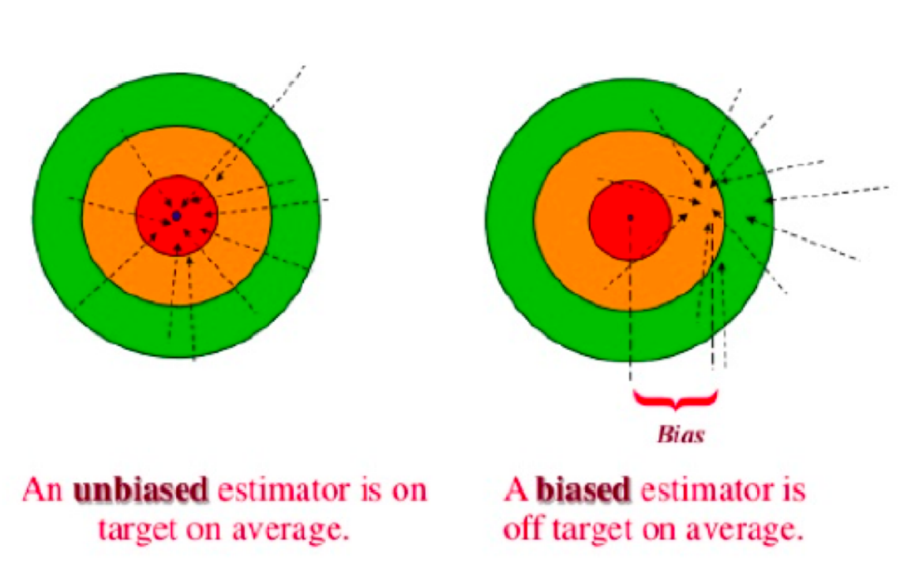
```

## Consistency
```{r, echo=FALSE, fig.cap="", out.width = '90%'}
    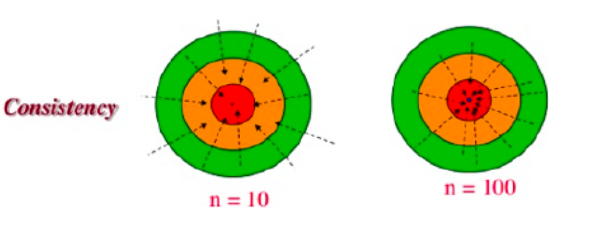
```

## Efficiency
```{r, echo=FALSE, fig.cap="", out.width = '90%'}
    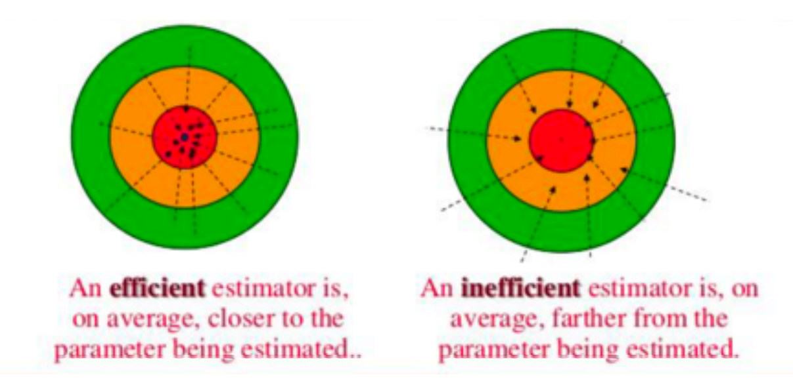
```


## Properties of the sample mean

- Let $\mu_Y$ and $\sigma^2_{Y}$ denote the mean and variance of Y (总体的均值和方差)
- Let $\bar{Y}=\frac{1}{n}\sum_{i=1}^{n}Y_i$ of $Y_i$(样本均值)
- Then the expectation of the sample mean(样本均值的期望) is 
$$
E(\bar{Y})=\frac{1}{n}\sum_{i=1}^{n}E(Y_i)=\mu_Y
$$

  so Y is an **unbiased** estimator of $\mu_Y$

- Based on the L.L.N., $\bar{Y}\rightarrow\mu_Y$ so $\bar{Y}$ is also **consistent**.

## Properties of the sample mean
- The variance of sample mean (样本均值的方差)
$$
Var(\bar{Y})=var(\frac{1}{n}\sum_{i=1}^{N}Y_i)=\frac{1}{n^2}\sum_{i=1}^{N}Var(Y_i)=\frac{\sigma^2_{Y}}{n}
$$

- Then the standard deviation of the sample mean is $$\sigma_{\bar{Y}}=\frac{\sigma_Y}{\sqrt{n}}$$


## Properties of the sample mean
- Follow the C.L.T, the $\bar{Y}\stackrel{d}{\sim} N(\mu_Y, \frac{\sigma^2_Y}{n})$

- And let $Z$ be the standardized $\bar{Y}$,then $Z=\frac{\bar{Y}-\mu_Y}{\frac{\sigma}{\sqrt{n}}}\stackrel{d}{\sim} N(0,1)$

- Let $\mu_Y$ and $\sigma^2_Y$ denote the mean and variance of $Y_i$, then the **sample variance**:
$$
S^2_Y=\frac{1}{n-1}\sum_{i=1}^{n}(Y_i-\bar{Y})^2
$$
- Then it is easy to prove that
  1. $E(S^2_Y)=\sigma^2_Y$, thus $S^2$ is an **unbiased** estimator of $\sigma^2_Y$ which is also the reason why the average uses the divisor $n-1$ instead of $n$.
  2. $S^2_Y \stackrel{P}{\longrightarrow} \sigma^2_Y$, thus the sample variance is a **consistent estimator** of the **population variance**.


## The Standard Error
- Recall: the standardized sample mean will be approximately follow a standard normal distribution when $n$ is large.
$$
Z=\frac{\bar{Y}-\mu_Y}{\frac{\sigma}{\sqrt{n}}}\stackrel{d}{\sim} N(0,1)
$$
- But in general $\sigma_Y$, the standard deviation of population is **unknown**, so we have to use sample to estimate it.
- Let $\sigma_{\bar{Y}}=\frac{\sigma_Y}{\sqrt{n}}$, because $S^2_Y$ is an unbiased and consistent estimator of the $\sigma^2_Y$, then we can use $\frac{S_Y}{\sqrt{n}}$ as an estimator of the standard deviation of the sample mean.

## The Standard Error

- It is called the **standard error(标准误)** of the **sample mean**
$$ 
SE[{\bar{Y}}]=\hat\sigma_{\bar{Y}}=\frac{S_Y}{\sqrt{n}}
$$
- Equivalence to the **standard deviation(标准差)** of the sample distribution which measures the **deviations** of the sample mean.

## Application: Sample Size and Standard Error(Population)

- Population $\sim N(0,SD)$
    ```{r, echo=FALSE, fig.cap="", out.width = '90%'}
    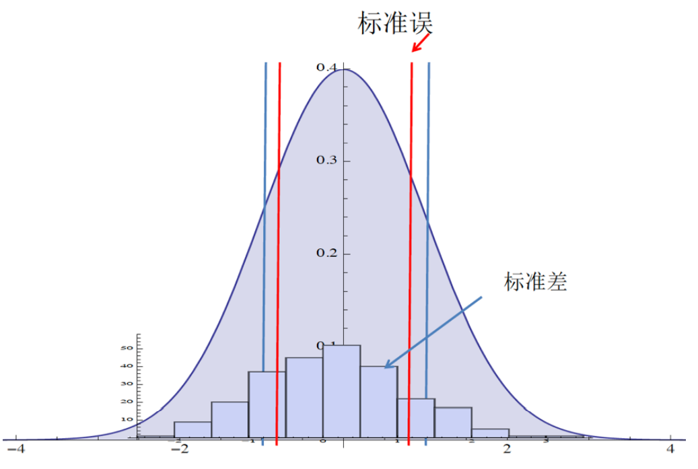
    ```

## Sample Size and Standard Error(sample n=250)
```{r, echo=FALSE, fig.cap="", out.width = '90%'}
    
```

## Sample Size and Standard Error(n=500)
```{r, echo=FALSE, fig.cap="", out.width = '90%'}
    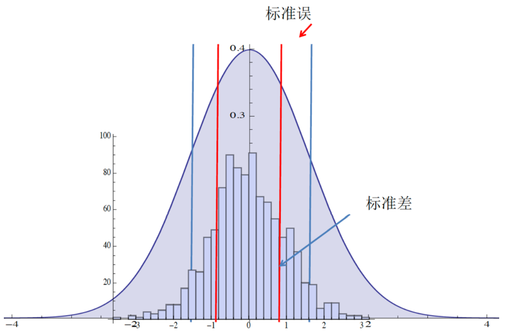
    ```

## Sample Size and Standard Error(sample n=1000)
```{r, echo=FALSE, fig.cap="", out.width = '90%'}
    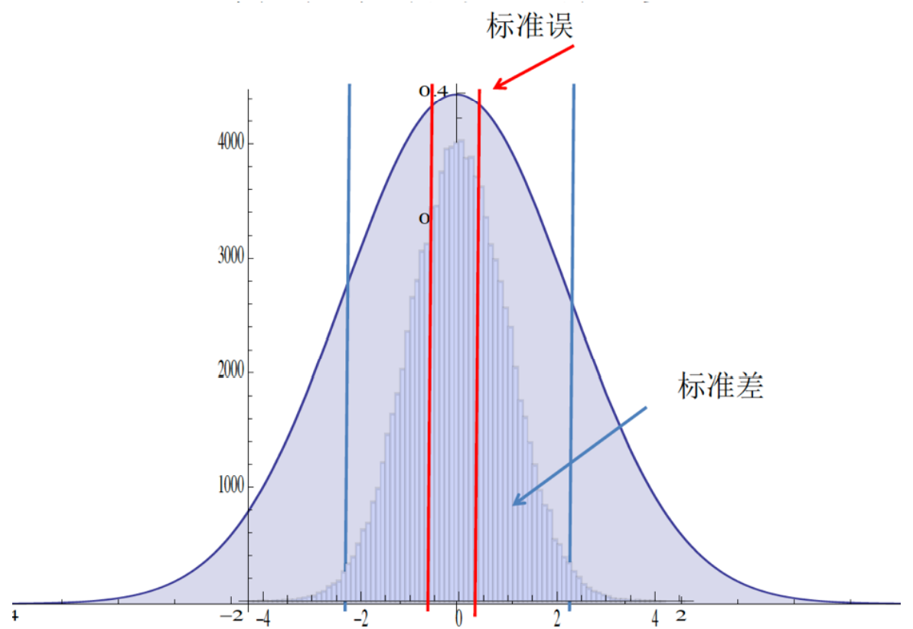
```

## Recall: The Chi-Square Distribution

- Let $Z_i(i=1,2, ..., m)$ be independent random variables, each
distributed as standard normal. Then a new random variable
can be defined as the sum of the squares of $Z_i$:
$$ X= \sum_{i=1}^{m} Z^2_i $$

  Then $X$ has a **chi-squared distribution** with $m$ degrees of freedom.
- Then, it can be prove that a variation of the sample variance will follow a **Chi-Square** distribution:

$$
\frac{(n-1)S^2_Y}{\sigma_2} \sim \chi^2_{n-1}
$$


## The Student-t Distribution
- The Student t distribution can be obtained from a **standard normal** and a **chi-square** random variable.
- Let $Z$ have a standard normal distribution, let $X$ have a chi-square distribution with $n$ degrees of freedom and assume that $Z$ and $X$ are independent. Then the random variable
$$
T= \frac{Z}{\sqrt{\frac{X}{n}}}
$$
  has a **t-distribution** with n degrees of freedom, denoted as $T\sim t_n$
- Then, the $\bar{Z}$ will follow a student t distribution.
$$
\bar{Z}=\frac{\bar{Y}-\mu_Y}{\frac{S_Y}{\sqrt{n}}}\stackrel{d}{\sim} t(n-1)
$$

## The Student-t Distribution

- It does not matter a lot in the large sample.
- As the degrees of freedom get large which is highly correlated with the sample size n, the **t-distribution** actually approaches the **standard normal distribution**.


# Confidence Interval and Interval Estimation

## Interval Estimation

- A point estimate provides no information about how close the estimate is likely to be to the population parameter.
- We cannot know how close an estimate for a particular sample is to the population parameter because the population is never known.
- A different (complementary) approach to estimation is to produce **a range of values** that will contain the truth with some fixed probability.

## What is a Confidence Interval?

### Definition
- A $100(1-\alpha)\%$ confidence interval for a population parameter $\theta$ is an interval $C_n=(a,b)$, where $a=a(Y_1,Y_2,...,Y_n)$ and $b=b(Y_1,Y_2,...,Y_n)$ are functions of the data such that 
$$
P(a< \theta< b)=1-\alpha
$$

  - In general, this **confidence level** is $1-\alpha$ (置信水平); where $\alpha$ is called **significance level**(显著性水平).
  - The key is how to obtain or construct the values of $a$ and $b$ 


## Interval Estimation and Condence Intervals

- Suppose the population has a normal distribution $N(\mu,\sigma^2)$ and let $Y_1,Y_2,...,Y_n$ be a random sample
from the population.

  - Then the sample mean $\bar{Y}$ has a normal distribution: $\bar{Y}\sim N(\mu,\frac{\sigma^2}{n})$
  - The standardized sample mean $\bar{Z}$ is given by: 
  $$
  \bar{Z}=\frac{\bar{Y}-\mu}{\frac{\sigma}{\sqrt{n}}}\sim N(0,1)
  $$

- Then let $\theta=\bar{Z}$,then $P(a<\theta< b)=1-\alpha$ turns into
$$
a<\frac{\bar{Y}-\mu}{\frac{\sigma}{\sqrt{n}}} < b
$$

  then it follows that
$$
P(\bar{Y}-a\frac{\sigma}{\sqrt{n}}<\mu<\bar{Y}+b\frac{\sigma}{\sqrt{n}})=1-\alpha
$$

- Thus the **random interval** contains the population mean  with a probability $1-\alpha$

## Interval Estimation and Condence Intervals

### Two cases:$\sigma$ is known and unknown

- When $\sigma$ is known, for example, $\sigma=1$,thus $Y\sim N(\mu,1)$,$\bar{Y}\sim N(\mu,\frac{\sigma^2}{n}=\frac{1}{n})$

- From this we can standardize $\bar{Y}$, and because the standardized version of $\bar{Y}$ has a standard normal distribution, and we let $\alpha=0.05$,then we have 
$$
P(-1.96<\frac{\bar{Y}-{\mu}}{\frac{1}{\sqrt{n}}}<1.96)=1-0.05
$$
- The event in parentheses is identical to $\bar{Y}-\frac{1.96}{\sqrt{n}}<\mu<\bar{Y}+\frac{1.96}{\sqrt{n}}$
- So 
$P(\bar{Y}-\frac{1.96}{\sqrt{n}}<\mu<\bar{Y}+\frac{1.96}{\sqrt{n}})=0.95$
- The interval estimate of $\mu$ may be written as 
$[\bar{Y}-\frac{1.96}{\sqrt{n}},\bar{Y}+\frac{1.96}{\sqrt{n}}]$

## Interval Estimation and Condence Intervals

- When $\sigma$ is unknown, we could use an estimate of $\sigma$, thus $SE[\bar{Y}]=\hat\sigma_{\bar{Y}}=\frac{S_Y}{\sqrt{n}}$, the sample **standard error**, replacing unknown $\sigma$ thus
$$
\bar{Z_t}=\frac{\bar{Y}-\mu_Y}{\frac{S_Y}{\sqrt{n}}}=\frac{\bar{Y}-\mu_Y}{SE[\bar{Y}]}
$$
- We just suggested that it follows a student t distribution.

### Definition
The **t-statistic** or **t-ratio**:
$$
\frac{\bar{Y}-\mu}{SE(\bar{Y})}\sim t_{n-1}
$$

## Interval Estimation and Condence Intervals

- To construct a 95% confidence interval, let $c$ denote the $97.5^th$ percentile in the $t_{n-1}$ distribution.
$$
P(-c< t\le c)=0.95
$$
where $c_{\frac{\alpha}{2}}$ is the critical value of the t distribution.
- The confidence interval may be written as $[Y\pm c_{\frac{\alpha}{2}}\frac{S}{\sqrt{n}}]$

## Interval Estimation and Condence Intervals
```{r, echo=FALSE, fig.cap="", out.width = '90%'}
    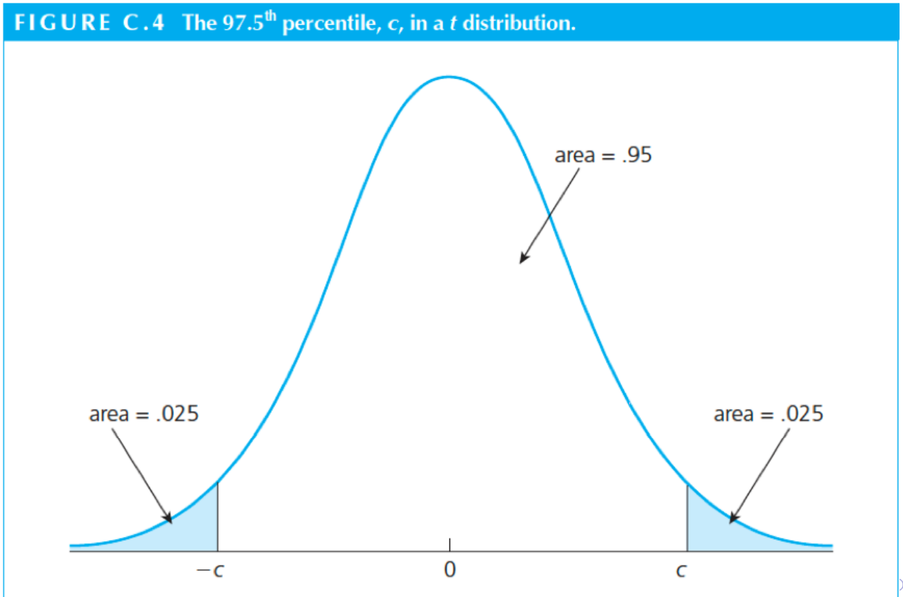
```

## A simple rule of thumb for a 95% confidence interval

- Because as the degrees of freedom get large which is highly
correlated with the sample size n, the **t-distribution** approaches **the standard normal distribution**.

- And $\Phi(1.96)=0.975$, so a rule of thumb for an approximate 95% confidence interval is 
$$
[\bar{Y}\pm 1.96 \times SE(\bar{Y})]
$$
- Or 
$$
[\bar{Y}\pm 2 \times SE(\bar{Y})]
$$

# Hypothesis Testing

## Hypothesis Testing(假设检验)

### Definition

A hypothesis is a **statement** about a population parameter,thus $\theta$.Formally,we want to test whether is **significantly** different from a certain value $\mu_0$
$$
H_0:\theta=\mu_0
$$

which is called **null hypothesis**.**The alternative hypothesis** is
$$
H_0:\theta{\ne} \mu_0
$$

- If the value $\mu_0$ does not lie within the calculated confidence interval, then we **reject** the null hypothesis.
- If the value $\mu_0$ lie within the calculated confidence interval,then we **fail to reject** the null hypothesis.

## Hypothesis Testing(假设检验)

- In criminal law, institutions in most countries follow the rule: "**innocent until proven guilty**" (疑罪从无)
  - The prosecutor wants to prove their hypothesis that the accused person is guilty.
  - However, the burden is on the prosecutor to show guilt.
  - The jury or judge starts with the "null hypothesis" that the accused person is innocent.

## Hypothesis Testing(假设检验)

- In program evaluations,instead of "presumption of innocence", the rule is: "presumption of insignificance".

- Policymaker's hypothesis: the program improves learning.

- Evaluators approach experiments using the hypothesis:
  - There is zero impact of the program
  - Then we test this "null hypothesis"

- The burden of proof is on the program
  - it should show a **statistically significant** impact.

## Two Type Errors

In both cases, there is a certain risk that our conclusion is wrong.

### Definition
- A **Type I** error is when we reject the null hypothesis when it is in fact true.
- A **Type II** error is when we fail to reject the null hypothesis when it is false.
  - In criminal trial
    -**The Type I**: the judge reject the null hypothesis when the suspect is actually no guilty.
    “宁可错杀一千，不能放过一个.”
    -**The Type II**: the judge fail to reject the null hypothesis when the suspect is actually guilty.
    “宁可放过一千，不能错杀一个.”

## The Significance level(显著性水平)

### Definition
- The **significance level** or size of a test is the maximum probability for the $Type{\;}I{\;}Error$
$$
P(Type{\;}I{\;}error)=P(reject{\;}H_0 | H_0{\;}is{\;}true)={\alpha}
$$
- Usually, we has to carry the "burden of proof,"
- We would like to prove that the assertion of H1 is true by showing that the data rejects $H_0$.

## Testing Procedure
- The following are the steps of the hypothesis testing:
1. Specify $H_0$ and $H_1$.
2. Choose the significance level ${\alpha}$.
3. Define a decision rule **(critical value)**.
4. Given the data compute the test statistic and see if it falls into the critical region.

## Decision Rule
- The decision rule that leads us to reject or not to reject $H_0$ is based on a test statistic, which is a function of the data
$$
T_n=T(Y_1,Y_2,...,Y_n)
$$
- Usually, one rejects $H_0$ if the test statistic falls into a critical region(rejection region). A critical region is constructed by taking into account the probability of making wrong decisions,thus ${\alpha}$.
By convention, ${\alpha}$ is chosen to be a small number, for example, ${\alpha}$ = 0.01, 0.05, or 0.10

## P-value

- To provide additional information, we could ask the question: What is the largest significance level at which we could carry out the test and still fail to reject the null hypothesis?

We can consider the **p-value** of a test

- Calculate the t-statistic
- The largest significance level at which we would fail to reject $H_0$ is the significance level associated with using t as our critical value.
$$
p-value=1-{\Phi}(t)
$$

where denotes the standard normal c.d.f.(we assume that n is large enough)

## P-Value
- Suppose that $t = 1.52$, then we can find the largest significance level at which we would fail to reject $H_0$
$$
p-value=P({T}>1.52 | {H_0})={1-{\Phi}(1.52)}=0.065
$$

```{r, echo=FALSE, fig.cap="", out.width = '60%'}
    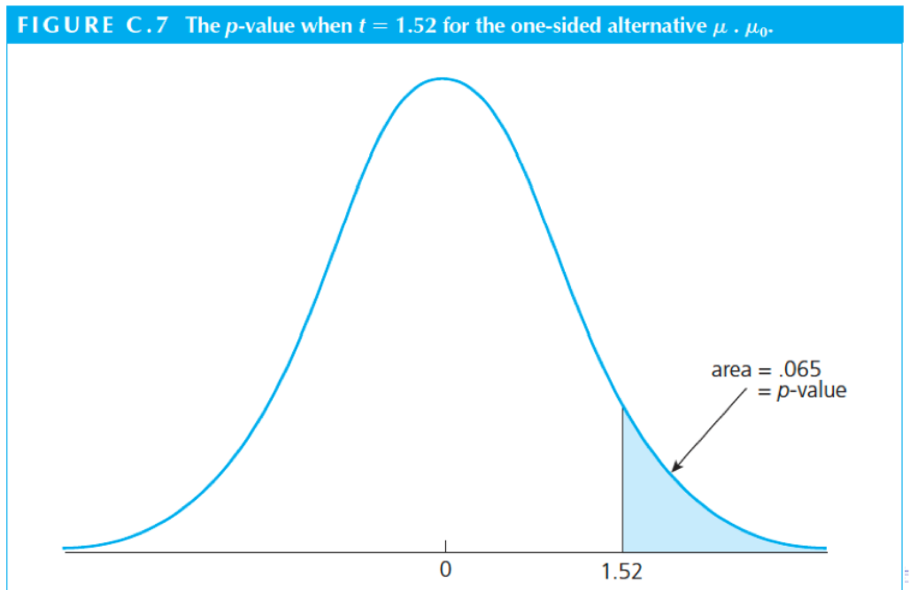
```


## Hypothesis Test of of $\bar{Y}$
- Specify $H_0$ and $H_1$
$$
{H_0}: E{[Y]}={\mu_{Y,0}} {;\;} {H_1}: E{[Y]}{\neq}{\mu_{Y,0}}.
$$
- Choose the significance level ${\alpha}$ and define a decision rule (critical region or critical value)
  - e.g. if we choose ${\alpha} = 0.05$, then the critical value is 1.96, then the region is ${(}-{\infty},1.96{]}$ and ${[}1.96,+{\infty}{)}$


## Hypothesis Test of of $\bar{Y}$

```{r, echo=FALSE, fig.cap="", out.width = '90%'}
    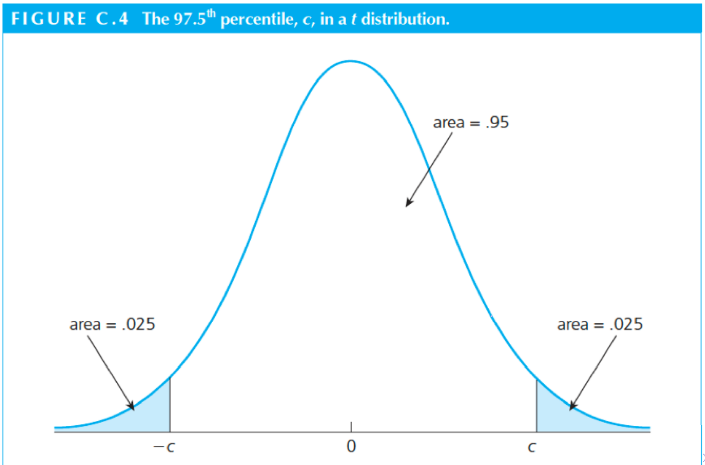
```


## Hypothesis Test of of $\bar{Y}$
- Given the data, compute the test statistic:
  - Step1: Compute the sample average $\bar{Y}$

  - Step2: Compute the **standard error** of $\bar{Y}$
  $$
  SE[\bar{Y}]=\frac{S_Y}{\sqrt{n}}
  $$

  - Step3: Compute the **t-statistic**
  $$
  t^act = \frac{\bar{Y}-{\mu_{Y,0}}}{SE[{\bar{Y}}]}
  $$

  - Step4: Reject the null hypothesis if
  $$
  {\mid} t^{act} {\mid} > critical{\;}value
  $$

    or if $$p−value < significance{\;}}level $$
